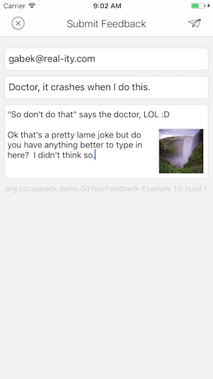
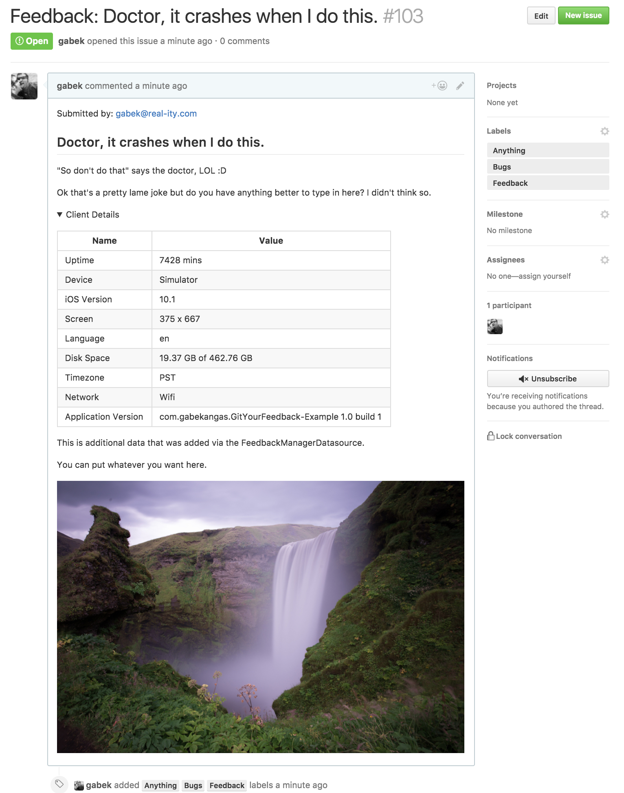
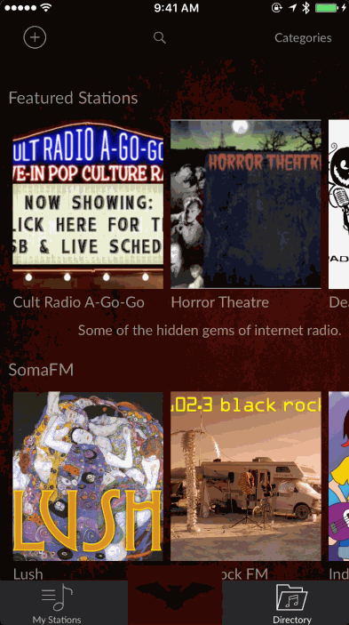

# GitYourFeedback

[](https://github.com/gabek/GitYourFeedback)
[](https://github.com/gabek/GitYourFeedback)


A lot of organizations run on GitHub, not just for the code repositories, but also for the heavy use of Issues, the bug tracking/feedback reporting tool.  Instead of routing your users to GitHub and expecting them to file issues, this is an option to support it right from inside your iOS application.

## Example

To run the example project:

* Clone the repo, and run `pod install` from the Example directory.
* Edit `Config.swift` and add your GitHub details (user, api key, repo) and Google Cloud Storage bucket name.
* This must be a publicly accessible Google Cloud Storage bucket, as it needs permissions to upload and read the file.
* Run the project either on a device and take a screenshot, or press the button in the simulator to bring up the feedback interface.

### The client will look like: 



### While the resulting GitHub issue will look like:



## Requirements
* Google Cloud Storage bucket for storing the screenshots.
* GitHub repository for storing the issues.

## Installation

GitYourFeedback is available through [CocoaPods](http://cocoapods.org). To install
it, simply add the following line to your Podfile:

```ruby
pod "GitYourFeedback"
```

Or, if you’re using [Carthage](https://github.com/Carthage/Carthage), add GitYourFeedback to your Cartfile:

github "gabek/GitYourFeedback"

1. Generate a [Personal Access Token](https://help.github.com/articles/creating-an-access-token-for-command-line-use/) for the GitHub user who will be saving the issues in your repo.

2. In your project's `Info.plist` add a key of `NSPhotoLibraryUsageDescription` with a string explaining that your use of the photo library is for submitting screenshots.  This is user-facing so use your own judgement.

3. Create a struct that adheres to the FeedbackOptions protocol. It should be as simple as:
```
struct MyFeedbackReportingOptions: FeedbackOptions {
    // The GitHub personal access token for the below user 
    var token: String = "abc123"
    /// The user that generated the above Personal Access Token and has access to the repository.
    var user: String = "repoman"
    /// The Github repository in username/repo format where the issue will be saved.
    var repo: String = "repoman/myRepository"
}
```
4. In your AppDelegate, or some other long-lived controller:


```
let feedbackReporter = FeedbackReporter(options: MyFeedbackReportingOptions())
```

You also need to implement `FeedbackReporterDatasource` in order to tell the FeedbackReporter where to upload screenshots.  The simplest implementation would be something like:

```
func uploadUrl(_ completionHandler: (String) -> Void) {
    let filename = String(Date().timeIntervalSince1970) + ".jpg"
    let url = "https://www.googleapis.com/upload/storage/v1/b/mybucketname.appspot.com/o?name=\(filename)"
    completionHandler(url)
}
```

And there are other methods you can implement as well, to provide additional information in the issues that get filed.

```
func additionalData() -> String?
func issueLabels() -> [String]?
```

This is also where you could generate, possibly from your backend, a signed URL so the Google Cloud Storage bucket doesn't need to be completely public.

## Presenting the Feedback interface

The interface will automatically display as a result of a user taking a screenshot.  If this is the first time the user has taken a screenshot in your application they will be greeted with an iOS permissions dialog stating they need to grant your app access to the user's Photos in order to use the screenshot.  You may want to emphasize that the user should accept this.  It uses the copy you added in your Info.plist's `NSPhotoLibraryUsageDescription` key.

You could also manually fire `feedback.display()` with an optional specific view controller to present from.  With this approach the user will have to select their own screenshot manually if they want to send one.



## Author

Gabe Kangas, gabek@real-ity.com.  [@gabek](http://twitter.com/gabek)

Icon credits: designed by [Madebyoliver](http://www.flaticon.com/packs/essential-set-2) from Flaticon.

## License

GitYourFeedback is available under the [MIT license](https://github.com/gabek/GitYourFeedback/blob/master/LICENSE). See the LICENSE file for more info.
